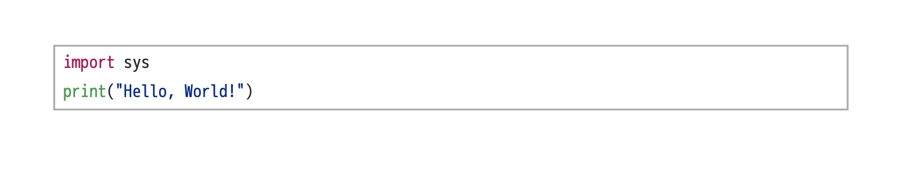

# satynx

satynx は SATySFi でシンタックスハイライトのついたコードを組むためのパッケージです．

## Installation

[satysfi-base](https://github.com/nyuichi/satysfi-base) が必要です．
それ以外は通常の SATySFi のパッケージと同様に，
`~/.satysfi/dist/packages` にでも `satynx.satyh` を置けば完了です．

## Usage

satynx パッケージは主に `+satynx-code` というブロックコマンドと
その中で用いる `\fg` コマンドを提供します．

例えば，以下のような Python コードを文書中に表示したいとします．

```
import sys
print("Hello, World!")
```

この場合，たとえば以下のように記述することで， SATySFi で正しくハイライトすることができます．

```
+satynx-code{
| \fg((167,29,93))(#`import`#);\fg((50,50,50))(#` `#);\fg((50,50,50))(#`sys`#);\fg((50,50,50))(` `);
| \fg((98,163,92))(#`print`#);\fg((50,50,50))(#`(`#);\fg((24,54,145))(#`"`#);\fg((24,54,145))(#`Hello, World!`#);\fg((24,54,145))(#`"`#);\fg((50,50,50))(#`)`#);\fg((50,50,50))(` `);
|}
```



このようにかなり煩雑なコードが必要ですが，
SATySFi の記述は [Rust 製の command-line program](https://github.com/monaqa/rust-satynx) によって自動で生成できます．
